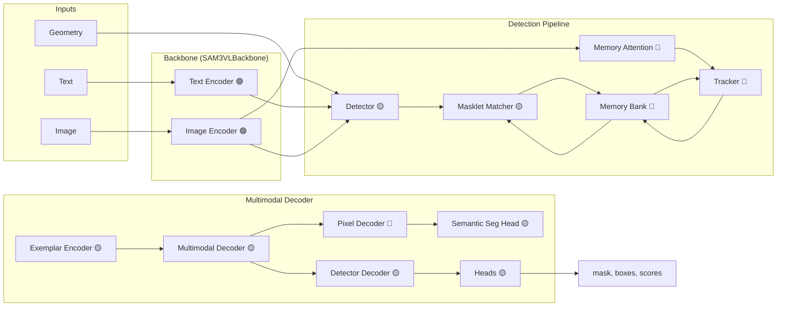
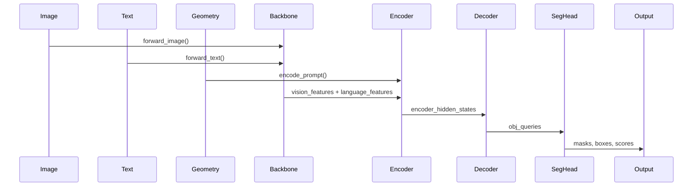
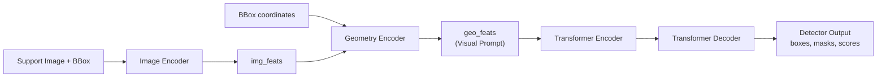
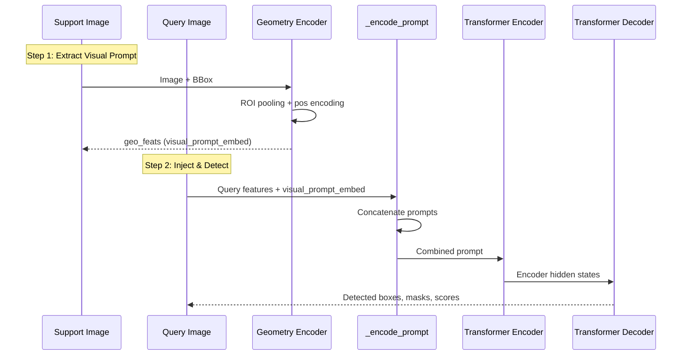

# SAM3 Architecture Walkthrough

> **Paper-to-Code Mapping** for the SAM3 Research Project

## Architecture Overview (from Paper Figure 10)

The SAM3 architecture extends SAM2 with new components for **multimodal detection and tracking**. The diagram shows three component origins:
- 🟡 **Yellow**: New components in SAM3
- 🔵 **Blue**: Components from SAM2
- 🟢 **Cyan**: Components from Perception Encoder (PE)



---

## Core Component Code Mapping

### 1. Image Encoder (ViT Backbone)
**Paper**: Vision Transformer backbone for visual feature extraction  
**Code**: [vitdet.py](file:///e:/Research/SAM3_research/sam3/model/vitdet.py)

| Class | Purpose | Key Features |
|-------|---------|--------------|
| `ViT` (L568-882) | Main ViT backbone | Patch embedding, windowed attention, RoPE |
| `PatchEmbed` (L301-338) | Image → patches | Conv2d projection |
| `Attention` (L341-517) | Multi-head attention | Relative pos, 2D-RoPE |
| `Block` | Transformer block | Self-attention + FFN |

```python
# Key functions in vitdet.py
apply_rotary_enc()      # L70-92: Apply 2D rotary embeddings
window_partition()      # L95-115: Partition for windowed attention
window_unpartition()    # L118-141: Reverse window partition
```

---

### 2. Text Encoder
**Paper**: Language backbone for text understanding  
**Code**: [text_encoder_ve.py](file:///e:/Research/SAM3_research/sam3/model/text_encoder_ve.py)

| Class | Lines | Purpose |
|-------|-------|---------|
| `VETextEncoder` | L255-330 | Main text encoder with tokenizer |
| `TextTransformer` | L166-252 | CLIP-style text transformer |
| `Transformer` | L92-147 | Stack of attention blocks |
| `ResidualAttentionBlock` | L15-89 | Self-attention + cross-attention |

---

### 3. Vision-Language Backbone Combiner
**Paper**: Combines vision and language without fusion  
**Code**: [vl_combiner.py](file:///e:/Research/SAM3_research/sam3/model/vl_combiner.py)

```python
class SAM3VLBackbone(nn.Module):   # L18-177
    # Combines: Sam3DualViTDetNeck (visual) + VETextEncoder (text)
    
    def forward(self, samples, captions, input_boxes, additional_text):
        output = self.forward_image(samples)      # Vision features
        output.update(self.forward_text(...))     # Language features
        return output
```

**Output Dictionary**:
- `vision_features`: Image features from backbone
- `language_features`: Text features from encoder
- `language_mask`: Attention mask for text
- `vision_pos_enc`: Positional encodings
- `backbone_fpn`: Feature pyramid outputs

---

### 4. Geometry Encoder (Prompt Encoding)
**Paper**: Encodes geometric prompts (boxes, points, masks)  
**Code**: [geometry_encoders.py](file:///e:/Research/SAM3_research/sam3/model/geometry_encoders.py)

| Class | Lines | Purpose |
|-------|-------|---------|
| `Prompt` | L83-401 | Utility class for geometric prompts |
| `SequenceGeometryEncoder` | L470-838 | Full geometry encoder |
| `MaskEncoder` | L404-422 | Base mask encoder |
| `FusedMaskEncoder` | L425-467 | Mask + pixel feature fusion |

```python
class Prompt:
    # Manages: box_embeddings, point_embeddings, mask_embeddings
    # Methods: append_boxes(), append_points(), append_masks()
    
class SequenceGeometryEncoder:
    # Encodes boxes as points (optionally)
    # ROI pooling for box features
    # Position encoding for geometry
```

---

### 5. Transformer Encoder
**Paper**: Fuses text and image features  
**Code**: [encoder.py](file:///e:/Research/SAM3_research/sam3/model/encoder.py)

| Class | Lines | Purpose |
|-------|-------|---------|
| `TransformerEncoderLayer` | L15-251 | Self-attn → Cross-attn |
| `TransformerEncoder` | L254-461 | Multi-level feature encoder |
| `TransformerEncoderFusion` | L464-579 | **Text-Image fusion encoder** |

```python
class TransformerEncoderFusion(TransformerEncoder):
    # Key: Fuses text and image features
    # add_pooled_text_to_img_feat: Add pooled text to image features
    # pool_text_with_mask: Use mask for text pooling
```

---

### 6. Transformer Decoder
**Paper**: Detector Decoder with presence token  
**Code**: [decoder.py](file:///e:/Research/SAM3_research/sam3/model/decoder.py)

| Class | Lines | Purpose |
|-------|-------|---------|
| `TransformerDecoderLayer` | L28-184 | Self-attn → Cross-attn → FFN |
| `TransformerDecoder` | L187-608 | Main detector decoder |
| `TransformerEncoderCrossAttention` | L611-720 | Cross-attention encoder variant |

```python
class TransformerDecoder:
    # num_queries: Detection query tokens
    # presence_head: Predicts object presence 🟡
    # box_head: Predicts bounding boxes
    # use_text_cross_attention: Text-guided detection
```

---

### 7. Segmentation Head
**Paper**: Pixel Decoder + Semantic Segmentation Head  
**Code**: [maskformer_segmentation.py](file:///e:/Research/SAM3_research/sam3/model/maskformer_segmentation.py)

| Class | Lines | Purpose |
|-------|-------|---------|
| `PixelDecoder` | L174-221 | Upsamples features for masks |
| `MaskPredictor` | L25-53 | Generates mask predictions |
| `SegmentationHead` | L56-171 | Instance segmentation |
| `UniversalSegmentationHead` | L224-327 | Semantic + Instance seg |
| `LinearPresenceHead` | L16-22 | Presence prediction |

---

### 8. Memory Bank & Tracker
**Paper**: Per-object memory bank for video tracking  
**Code**: 
- [memory.py](file:///e:/Research/SAM3_research/sam3/model/memory.py) - Memory encoder
- [sam3_tracker_base.py](file:///e:/Research/SAM3_research/sam3/model/sam3_tracker_base.py) - Tracker

```python
class SimpleMaskEncoder:  # memory.py L160-203
    # Encodes masks for memory bank
    # Components: mask_downsampler, fuser, position_encoding
    
class SimpleMaskDownSampler:  # L21-80
    # Progressive mask downsampling
```

---

### 9. Main SAM3 Image Model
**Paper**: Complete SAM3 pipeline  
**Code**: [sam3_image.py](file:///e:/Research/SAM3_research/sam3/model/sam3_image.py)

```python
class Sam3Image(nn.Module):  # L33-681
    TEXT_ID_FOR_TEXT = 0
    TEXT_ID_FOR_VISUAL = 1  
    TEXT_ID_FOR_GEOMETRIC = 2
    
    def __init__(self, backbone, transformer, input_geometry_encoder, 
                 segmentation_head, dot_prod_scoring, ...):
        # Combines all components
    
    # Core forward methods:
    def _get_img_feats()      # L114-164: Get image features
    def _encode_prompt()      # L166-209: Encode text/visual/geometric prompts
    def _run_encoder()        # L211-249: Run transformer encoder
    def _run_decoder()        # L251-297: Run transformer decoder
    def _run_segmentation_heads()  # L385-423: Generate masks
    def forward_grounding()   # L439-490: Full grounding pipeline
```

---

### 10. Model Builder
**Code**: [model_builder.py](file:///e:/Research/SAM3_research/sam3/model_builder.py)

Key builder functions that assemble the architecture:

| Function | Lines | Purpose |
|----------|-------|---------|
| `build_sam3_image_model` | L560-641 | **Main image model builder** |
| `build_sam3_video_model` | L653-791 | Video model builder |
| `_create_vit_backbone` | L72-99 | ViT backbone |
| `_create_vl_backbone` | L113-115 | Vision-Language backbone |
| `_create_transformer_encoder` | L118-153 | Encoder creation |
| `_create_transformer_decoder` | L156-190 | Decoder creation |
| `_create_geometry_encoder` | L235-288 | Geometry encoder |
| `_create_segmentation_head` | L207-232 | Segmentation head |

---

## Data Flow Summary



---

## Key Innovations (from Paper)

1. **Presence Token** 🟡 - New token to predict object presence
2. **Exemplar Encoder** 🟡 - Encodes visual examples for few-shot learning
3. **Multimodal Decoder** 🟡 - Handles text, visual, and geometric prompts
4. **Masklet Matcher** 🟡 - Matches masklets across frames
5. **Semantic Seg Head** 🟡 - Unified semantic + instance segmentation

---

## File Structure Summary

```
sam3/model/
├── sam3_image.py          # Main SAM3 image model (Sam3Image)
├── sam3_video_*.py        # Video tracking variants
├── model_builder.py       # Model construction functions
├── vitdet.py              # ViT backbone (Image Encoder)
├── text_encoder_ve.py     # Text Encoder
├── vl_combiner.py         # Vision-Language Backbone
├── geometry_encoders.py   # Prompt encoding (box/point/mask)
├── encoder.py             # Transformer Encoder
├── decoder.py             # Transformer Decoder
├── maskformer_segmentation.py  # Segmentation heads
├── memory.py              # Memory bank components
└── box_ops.py             # Box coordinate utilities
```

---

## Cross-Image Few-Shot Detection

> Reference: `examples/cross_image_few_shot_detection.ipynb`

### Q1: `geo_feats` 是 Detector 的 output 嗎？

**否！** `geo_feats` 是 **Geometry Encoder 的輸出**，是 Detector 的 **輸入** 之一。



在 `extract_visual_prompt_embedding` 中：
```python
# 1. 取得 Support Image 的視覺特徵
img_feats = processor.model._get_img_feats(backbone_out, ...)

# 2. Geometry Encoder 編碼 BBox → geo_feats (非 Detector 輸出！)
geo_feats, geo_masks = processor.model.geometry_encoder(
    geo_prompt=geometric_prompt,    # BBox 座標
    img_feats=img_feats,            # 圖像特徵 (用於 ROI pooling)
    img_pos_embeds=img_pos_embeds,  # 位置編碼
)
```

**`geo_feats` 組成**：
- BBox 座標的直接投影 (`boxes_direct_project`)
- 從 `img_feats` 進行 ROI pooling 的區域特徵 (`boxes_pool`)
- 位置編碼 (`boxes_pos_enc`)

---

### Q2: Support Image 與 Query Image 如何進行 Few-Shot？

核心機制：**將 Support Image 的 Visual Prompt 注入到 Query Image 的推論過程**



#### 關鍵程式碼 (grounding_with_visual_prompt):

```python
# Step 1: 從 Support Image 提取 visual prompt
visual_prompt_embed, visual_prompt_mask = extract_visual_prompt_embedding(
    processor, support_image, support_box
)

# Step 2: 注入到 Query Image 的 _encode_prompt
prompt, prompt_mask, backbone_out = processor.model._encode_prompt(
    backbone_out,           # Query Image 的 backbone 輸出
    find_input,
    geometric_prompt,
    visual_prompt_embed=visual_prompt_embed,  # 👈 Support 特徵注入
    visual_prompt_mask=visual_prompt_mask
)

# Step 3-5: Encoder → Decoder → Segmentation
backbone_out, encoder_out, _ = processor.model._run_encoder(...)
out, hs = processor.model._run_decoder(...)
processor.model._run_segmentation_heads(...)
```

#### 流程對照表：

| 階段 | Support Image | Query Image |
|------|---------------|-------------|
| 1. Backbone | ✅ 提取視覺特徵 | ✅ 提取視覺特徵 |
| 2. Geometry Encoder | ✅ 用 BBox 提取 `geo_feats` | ❌ 不需要 BBox |
| 3. Prompt 組合 | - | ✅ 注入 Support 的 `geo_feats` |
| 4. Encoder → Decoder | - | ✅ 使用組合後的 prompt |
| 5. 輸出 | - | ✅ boxes, masks, scores |

**本質**：用 Support Image 的 BBox 區域特徵作為「視覺提示」，告訴模型「在 Query Image 中找類似這個區域的物體」。
